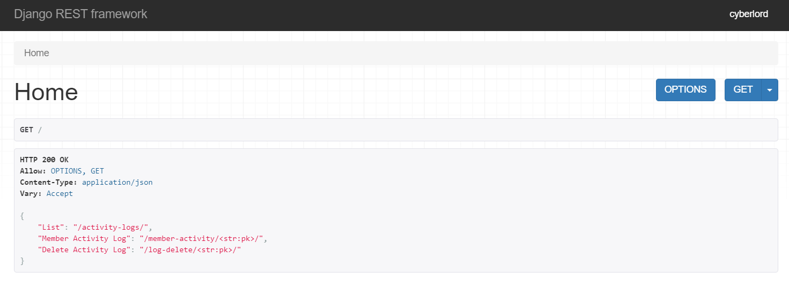

# Member Activity Logs
----------------------------------------------------------------
[Live URL]('https://fthtaskdrf.herokuapp.com/')

The application is a Django web app with consumption of Django Rest Framework for creating API to provid member activity logs.

### Frame Work & Libraries:
- Django
- Django REST Framework
- Names
- pytz

The application is configured to serve only `GET` and `DELETE` request no `POST` or `PUT` request can be made to alter activity logs.

> **The default route i.e. home page contains the list of all api endpoints.**



The API documentation can be found [API Docs]('static/Member_Activity.json'). The docs are generated using postman is compatible with latest version of Postman.

----------------------------------------------------------------
# API Documentation

API collection for the activity records from `https://fthtaskdrf.herokuapp.com` . The collection showcase 3 different API edpoints for testing:
- "List": "/activity-logs/",
- "Member Activity Log": "/member-activity/<str:pk>/",
- "Delete Activity Log": "/log-delete/<str:pk>/"

> Example of a single log:
```
{
    "id": 1,
    "real_name": "Era Harrison",
    "tz": "Eire",
    "activity_periods": [
        {
            "start_time": "2021-07-17T07:58:36Z",
            "end_time": "2021-02-16T05:15:28Z"
        }
    ]
}
```

### 1. GET Activity logs

To retrieve all the logs at once the request can be made to the following endpoint without any parameters.

**API Endpoint:** `https://fthtaskdrf.herokuapp.com/activity-logs/`

#### Example
Request: `https://fthtaskdrf.herokuapp.com/activity-logs/`

Response:
```JSON
{
    "ok": true,
    "members": [
        {
            "id": 3,
            "real_name": "Maria Esparza",
            "tz": "Pacific/Kwajalein",
            "activity_periods": [
                {
                    "start_time": "2021-05-21T08:46:12Z",
                    "end_time": "2020-10-23T20:13:59Z"
                }
            ]
        },
        {
            "id": 4,
            "real_name": "Geneva Hilley",
            "tz": "Europe/Vatican",
            "activity_periods": [
                {
                    "start_time": "2020-02-05T20:49:46Z",
                    "end_time": "2021-04-26T12:08:20Z"
                }
            ]
        },
        {
            "id": 5,
            "real_name": "Michelle Bones",
            "tz": "Australia/Currie",
            "activity_periods": [
                {
                    "start_time": "2020-08-11T13:53:26Z",
                    "end_time": "2020-10-30T16:48:35Z"
                }
            ]
        }, ...
    ]
}
```
### 2. GET member specific Log
We can get meber specific log by using member id from the data base for example purpose we used the default database ID which can be replace by any regular expression for production purpose.

### Member IDs
----
Member Ids are integers starting from 0 to 199 (as the database has only 200 members).

API end point: `http://fthtaskdrf.herokuapp.com/member-activity/<int:pk>/`

### EXAMPLE
Request: `http://fthtaskdrf.herokuapp.com/member-activity/2/`

RESPONSE:
```
{
    "id": 2,
    "real_name": "Judith Shea",
    "tz": "Europe/Berlin",
    "activity_periods": [
        {
            "start_time": "2021-10-13T10:45:30Z",
            "end_time": "2021-10-20T05:29:06Z"
        }
    ]
}
```
> **NOTE** : Only GET Requests are permitted on this Endpoint.

### 3. Deleting an acitvity log
----
This action is permitted with another endpoint and can be done only by using Member Ids.

**API ENDPOINT**: `https://fthtaskdrf.herokuapp.com/log-delete/<str:pk>/`

### EXAMPLE

*Request*: `https://fthtaskdrf.herokuapp.com/log-delete/1/`

*Response*:
```
{
    "Item Successfully Deleted"
}
```

----------------------------------------------------------------

Custom Commands to populate Database can be found [here]('webapp/management/commands/populate_db.py')

## NOTE:

The user must not expect CORS headers configuration as the sufficient information for that purpose was not provided.

The Member ID can be later changed to a regular expression if needed but for purpose of demonstration I have used default primary key for tables.

I have never done documentation but learning is what I always prefer this task showed me that documentatin is a very important part.

## Message For the Evaluator.
-----------------------------------
I enjoyed the task very much. I have learned many details in past 24 hours. Thanktou for your consideration and please let me now of the issues you faced during evaluation: `ritvikr1605@gmail.com` 
